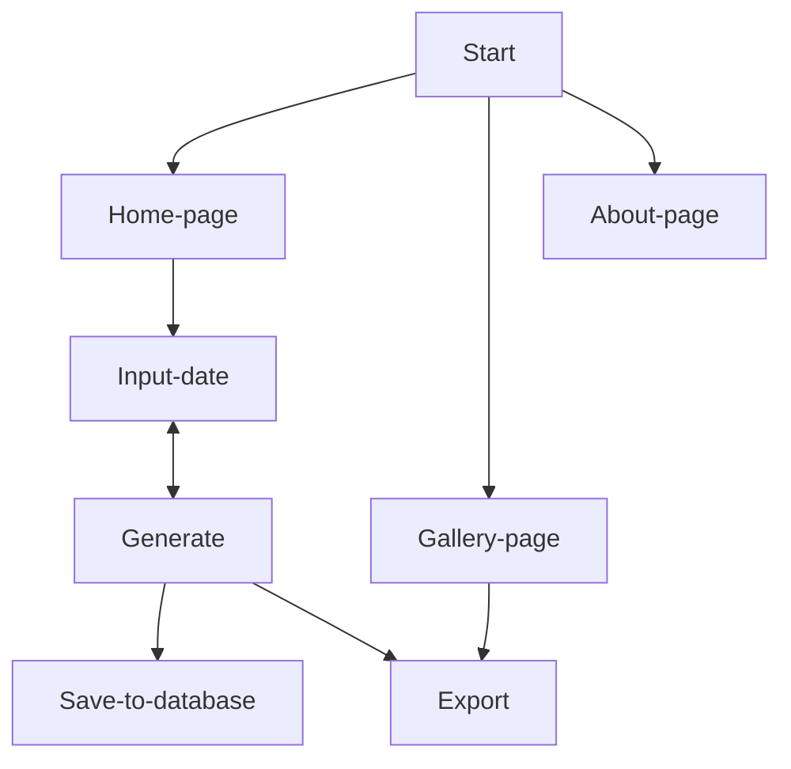

# SnowPrint

## Table of Contents
* [About Snowprint](README.md#about-snowprint)
* [How to use](README.md#how-to-use)
* [Stories](README.md#stories)
* [Workflow](README.md#workflow)
* [Coding Standards](README.md#coding-standards)
* [Authors](README.md#authors)


## About Snowprint
A group project at Algonquin College to generate snowflakes based on a date, that can then be saved or exported, with the eventual goal of usage with a 3D printer.

Any previously saved snowflakes are used as a means of decorating the background with real examples of what this program is capable of.

The folder ```original``` contains the initial implementation created by Stephen Gagne and Matthew Jerabek. The folder ```revised``` contains the final solution created by members of the student team "Snowprint". All content following this section is relating to the ```revised``` project. Anything relating to the original implementation will be prefixed with ```original```.

## How To Use
A brief flowchart to show the users options throughout normal operation.



### Home Page
1. Input date
2. Click 'Generate'
3. View generated snowflake
4. Save to database/Export it/Generate again

## Stories
<!-- Wrap stories that you are working on with a single * on each side to show it is in progress -->
<!-- To mark a task as complete, use [x] -->
<sub>Italics indicate that a story is *In Progress*</sub></br>

### Front End
- [ ] Home page skeleton
- [ ] Gallery page skeleton
- [ ] About page skeleton
- [ ] Home page styling
- [ ] Gallery page styling
- [ ] About page styling
- [ ] Canvas element styling
- [ ] Save buttons (stl, png, DB)
- [ ] Snowflake rendering in background
- [ ] Animate background
- [ ] favicon.png (16x16/32x32) 

### Back End
- [ ] Static snowflake drawing
- [ ] Date parsing implementation
- [ ] Dynamic snowflake drawing (1 style for now)
- [ ] Save to DB functionality
- [ ] Save to stl/png functionality

### Database
- [ ] Schema/Table skeleton
- [ ] Storing data manually
- [ ] AWS intergration

### Extras
- [ ] Export from Gallery
- [ ] Different designs (leaves, flowers, etc.)


## Workflow
1. Branch creation (front/story-name), (back/story-name), (database/story-name)
2. Complete story requirements
3. Push changes to remote branch
4. Create Pull Request (PR)
5. Peer review/testing
6. Merge branch into ```main```

## Coding Standards

This project was built following the javascript coding convention as outlined by w3schools.com (https://www.w3schools.com/js/js_conventions.asp). 

**We will be using tab indentation as opposed to spaces** 

## Authors

This idea of this program was created by Stephen Gagne and Matthew Jerabek of Algonquin College. 

The design and development of this program was completed by Mason MacDonald, Houssam Alhomsi, and Krushang Patel. All students of Algonquin College.
